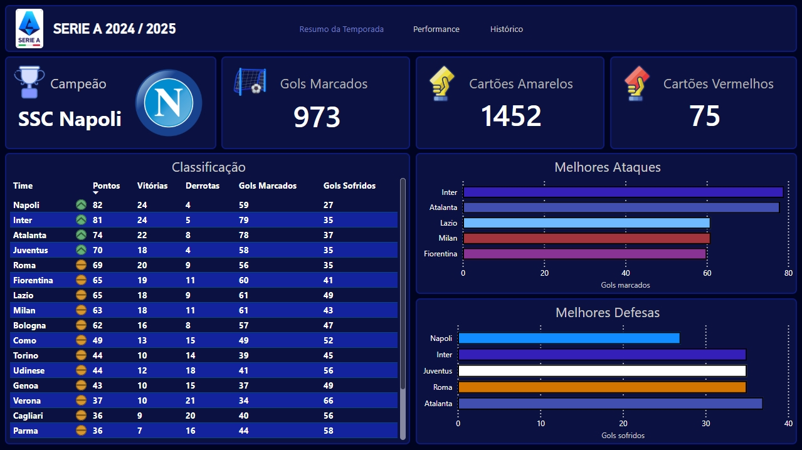

# Serie A 2024/2025 - Overview
Projeto envolvendo coleta, tratamento e visualização de dados do Campeonato Italiano Serie A - Temporada 2024/2025.

# Estrutura do repositório
```bash
serieA_2425_overview/
│
├── PowerBI/
│   └── serieA_dashboard.pbix
│   
├── assets/
│   └── logos/
│
├── data/
│   ├── processed/
│   │   └── season_stats.csv
│   │
│   └── raw/
│       └── serieA-season-2425.csv
│
├── scripts/
│   ├── 1_load_data.R
│   ├── 2_aggregation.R
│   ├── 3_process_data.R
│   └── 4_export.R
│
├── .gitignore
│
└── README.md
```

# Dados
Os dados foram coletados do site: https://datahub.io/football/italian-serie-a

A tabela contém:
| Campo | Descrição original | Descrição em Português |
|-------|---------------------|------------------------|
| Date | Match date | Data da partida |
| HomeTeam | Home team | Time mandante |
| AwayTeam | Away team | Time visitante |
| FTHG | Full Time Home Team Goals | Gols do time mandante no tempo regulamentar |
| FTAG | Full Time Away Team Goals | Gols do time visitante no tempo regulamentar |
| FTR | Full Time Result (H = Home Win, D = Draw, A = Away Win) | Resultado final da partida (H = vitória do mandante, D = empate, A = vitória do visitante) |
| HTHG | Half Time Home Team Goals | Gols do time mandante no primeiro tempo |
| HTAG | Half Time Away Team Goals | Gols do time visitante no primeiro tempo |
| HTR | Half Time Result (H = Home Win, D = Draw, A = Away Win) | Resultado do primeiro tempo (H = vitória do mandante, D = empate, A = vitória do visitante) |
| Referee | Match referee | Árbitro da partida (informação não disponível para Serie A) |
| HS | Home Team Shots | Finalizações do time mandante |
| AS | Away Team Shots | Finalizações do time visitante |
| HST | Home Team Shots on Target | Finalizações no alvo do time mandante |
| AST | Away Team Shots on Target | Finalizações no alvo do time visitante |
| HF | Home Team Fouls Committed | Faltas cometidas pelo time mandante |
| AF | Away Team Fouls Committed | Faltas cometidas pelo time visitante |
| HC | Home Team Corners | Escanteios do time mandante |
| AC | Away Team Corners | Escanteios do time visitante |
| HY | Home Team Yellow Cards | Cartões amarelos do time mandante |
| AY | Away Team Yellow Cards | Cartões amarelos do time visitante |
| HR | Home Team Red Cards | Cartões vermelhos do time mandante |
| AR | Away Team Red Cards | Cartões vermelhos do time visitante |

O objetivo foi transformar os dados originais que estavam orientados à partida (match level) em dados completos orientados por temporada (season level).

# Pipeline

O pipeline do projeto foi dividido em etapas para facilitar a organização e o processamento dos dados:

1. **Carregamento dos dados e tratamento inicial:** `scripts/1_load_data.R`
   - Leitura do arquivo CSV original contendo os dados das partidas da temporada;
   - Remoção de colunas não utilizadas.

2. **Agregações:** `scripts/2_aggregation.R`
   - Transformação dos dados orientados por partida (*match level*) em estatísticas agregadas por time (*season level*). Incluindo o total de:
     - gols marcados;
     - gols sofridos;
     - vitórias;
     - derrotas;
     - empates;
     - cartões amarelos/vermelhos;
     - finalizações;
     - faltas cometidas.

3. **Criação de métricas:** `scripts/3_process_data.R`
   - Desenvolvimento de métricas simples:
     - pontuação total;
     - saldo de gols;
     - total de partidas (igual para todos).

4. **Exportação:** `scripts/4_export.R`
   - Geração do dataset final processado para utilização no Power BI e construção do relatório.

# Dashboard

### Página 1: Resumo da Temporada
